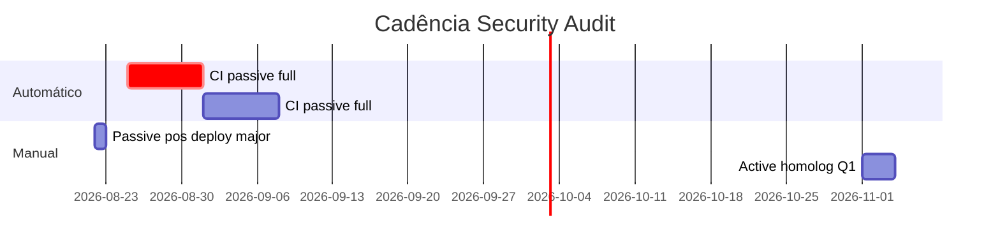

# Plano de Execução — Security Audit Vectra Hub

**Data:** 2026-08-19  
**Baseline:** run `20260820-020447-cd74c999` (passivo parcial: cors + clickjacking)  
**Ferramenta:** [`tools/security-audit/`](../../tools/security-audit/)  
**Spec:** [`docs/superpowers/specs/2026-08-19-saas-security-audit-design.md`](../specs/2026-08-19-saas-security-audit-design.md)

---

## 1. Objetivo

Operacionalizar auditoria DAST com:

- **Prod:** scan passivo semanal, sem risco operacional
- **Homolog:** scan ativo trimestral (SQLi, IDOR, burst)
- **Remediação:** fechar achados médios da baseline (CORS + clickjacking)

---

## 2. Situação atual (baseline)

| Métrica | Valor |
|---------|-------|
| Modo | passive |
| Scanners executados | 2 de 8 (`cors`, `clickjacking`) |
| Critical / High | 0 / 0 |
| Medium | 14 |

### Achados a tratar

| # | Achado | Onde | Prioridade |
|---|--------|------|------------|
| R1 | CORS `Access-Control-Allow-Origin: *` em Edge Functions | `calculate-freight`, `feira-save-quote`, `lookup-cep` | P1 |
| R2 | Sem `X-Frame-Options` / CSP `frame-ancestors` | `app.vectracargo.com.br`, `app.feira.vectracargo.com.br` | P1 |

**Causa raiz R1:** fallback em [`supabase/functions/_shared/cors.ts`](../../supabase/functions/_shared/cors.ts) quando Origin fora da allowlist.

**Causa raiz R2:** [`public/_headers`](../../public/_headers) só define `Cache-Control`.

---

## 3. Cadência de testes



| Tipo | Periodicidade | Modo | Alvo | Responsável |
|------|---------------|------|------|-------------|
| **CI GitHub Actions** | Segunda 06:00 UTC | passive full | `vectra.prod` | Automático |
| **Pós-deploy** | Quando `src/`, `supabase/functions/`, `_headers` mudam | passive full | prod | Dev que fez deploy |
| **Com JWT** | Mensal (1ª segunda) | passive + token | prod | Ops / lead |
| **Active pentest** | Trimestral | active | homolog | Segurança + `--i-am-authorized` |
| **pytest pacote** | Cada PR que toca `tools/security-audit/` | unit | local/CI | CI |

---

## 4. Fases de execução

### Fase 0 — Completar baseline (Semana 0, ~1h)

**Meta:** primeira rodada **passive completa** (todos scanners aplicáveis).

```bash
cd tools/security-audit
pip install -e ".[dev]"

# Full passive prod
saas-audit --preset vectra.prod \
  --mode passive \
  --output ../../audits/security \
  --ci

# Com JWT (mensal) — secrets no shell, nunca commit
saas-audit --preset vectra.prod \
  --token "$SAAS_AUDIT_TOKEN" \
  --output ../../audits/security
```

**Checklist Fase 0**

- [ ] Rodar passive **sem** `--tests` (8 módulos; sqli/idor = skipped esperado)
- [ ] Arquivar em `audits/security/{run_id}/`
- [ ] Ler `executive_summary.md` + `report.html`
- [ ] Configurar secret `SAAS_AUDIT_TOKEN` no GitHub (opcional, job manual)

**Scanners ainda não cobertos na baseline anterior**

| Scanner | Fase 0 | Observação |
|---------|--------|------------|
| rate_limit | ✅ roda | 8 GET observacional |
| cors | ✅ | já rodou |
| pii_leak | ✅ | `/`, `/auth` |
| jwt | ⚠️ | só com `--token` |
| user_enum | ✅ | recover sempre; login compare se `existing_email` |
| clickjacking | ✅ | já rodou |
| sqli | ⏭ skip | passive by design |
| idor | ⏭ skip | passive by design |

---

### Fase 1 — Remediação P1 (Semana 1–2)

#### R1 — CORS Edge Functions

| Passo | Ação | Done quando |
|-------|------|-------------|
| 1.1 | Remover fallback `*` em `getCorsHeaders` — retornar sem `Access-Control-Allow-Origin` se Origin inválido | OPTIONS/GET evil.com **não** recebe `*` |
| 1.2 | Deploy Edge Functions afetadas | Supabase functions deploy |
| 1.3 | Re-run `saas-audit --tests cors` | 0 medium CORS wildcard |

#### R2 — Clickjacking SPA

| Passo | Ação | Done quando |
|-------|------|-------------|
| 2.1 | Adicionar em `public/_headers`: `X-Frame-Options: DENY` ou CSP `frame-ancestors 'self'` | Header presente |
| 2.2 | Mesma regra no projeto Cloudflare **feira** se `_headers` separado | feira + hub ok |
| 2.3 | `npm run deploy` + **`npm run deploy:app`** (`cargo-flow-navigator` = `app.vectracargo.com.br`) + `deploy:feira` | prod live |
| 2.4 | Re-run `saas-audit --tests clickjacking` | 0 medium clickjacking |

**Critério de saída Fase 1:** passive full → **0 medium** nos scanners R1/R2 (ou documentar exceção aprovada).

---

### Fase 2 — Operacionalização CI (Semana 2)

| Passo | Ação |
|-------|------|
| 3.1 | Confirmar workflow [`.github/workflows/security-audit-passive.yml`](../../.github/workflows/security-audit-passive.yml) ativo no repo remoto |
| 3.2 | Primeira execução manual `workflow_dispatch` |
| 3.3 | Baixar artifact `security-audit-reports` e revisar |
| 3.4 | (Opcional) Slack webhook → `SAAS_AUDIT_WEBHOOK` secret + `--webhook-url` no workflow |

**Ajuste recomendado no workflow:** remover `|| true` quando baseline limpa — falhar CI em high/critical.

---

### Fase 3 — Cobertura autenticada (Mensal)

| Passo | Ação |
|-------|------|
| 4.1 | Criar usuário read-only homolog/prod para audit |
| 4.2 | GitHub secret `SAAS_AUDIT_TOKEN` |
| 4.3 | Job manual mensal ou step condicional com token |
| 4.4 | Validar scanners: **jwt** (alg, exp, logout-reuse), **pii_leak** autenticado |

**Config opcional** em `config/vectra.prod.yaml`:

```yaml
user_enum:
  existing_email: "audit-readonly@vectracargo.com.br"  # env override
  nonexistent_email: no-such-user-99999@example.invalid
```

---

### Fase 4 — Active homolog (Trimestral)

**Pré-requisitos**

- [ ] Ambiente staging URL no `config/vectra.staging.yaml`
- [ ] `--i-am-authorized` documentado
- [ ] `SAAS_AUDIT_USER_A_TOKEN` + `SAAS_AUDIT_USER_B_TOKEN`
- [ ] IDs reais em `idor_resources` (quotes/orders homolog)

```bash
saas-audit --config tools/security-audit/config/vectra.staging.yaml \
  --mode active \
  --i-am-authorized \
  --critical-stop \
  --tests sqli,idor,rate_limit \
  --output audits/security
```

| Scanner | O que valida |
|---------|--------------|
| sqli | payloads em `lookup-cep` etc. |
| idor | user B acessa recurso user A |
| rate_limit | burst 100 + 429/403 |

**Se critical_stop:** parar release, ticket P0, patch antes prod.

---

## 5. Matriz “testado vs não testado”

### Prod passive (semanal)

| Área | Testado | Não testado / limitação |
|------|---------|-------------------------|
| CORS malicioso | ✅ | Credenciais + reflexão simultânea (raro) |
| Clickjacking headers | ✅ | Ataque real em browser |
| PII em HTML público | ✅ | APIs autenticadas sem token |
| Rate limit login | ⚠️ observacional | Brute 100+ (active only) |
| JWT transport/revogação | ⚠️ | Sem token mensal |
| User enumeration login | ⚠️ | Sem `existing_email` = só recover |
| SQL injection | ❌ | Active homolog |
| IDOR | ❌ | Active homolog + 2 tokens |
| RLS Supabase direto | ❌ | Fora escopo DAST — audit SQL/RLS separado |
| Dependências (npm) | ❌ | `npm audit` / Dependabot |

### Complementar (fora `saas-audit`)

| Ferramenta | Periodicidade |
|------------|---------------|
| [`scripts/audit-compliance.ts`](../../scripts/audit-compliance.ts) | CI existente |
| OWASP ZAP / Burp | Trimestral homolog |
| Supabase advisors | Mensal |

---

## 6. Responsáveis e artefatos

| Papel | Responsabilidade |
|-------|------------------|
| Dev deploy | Fase 1 remediação + passive pós-deploy |
| Lead / Ops | Revisar weekly artifact + mensal JWT |
| Segurança | Trimestral active homolog |

**Artefatos por run**

```
audits/security/{run_id}/
  report.json
  report.html          ← revisão humana
  report.csv           ← SIEM/GRC
  executive_summary.md
  technical_summary.md
```

---

## 7. Cronograma sugerido (8 semanas)

| Semana | Entrega |
|--------|---------|
| S0 | Passive full + inventário findings |
| S1 | R2 clickjacking `_headers` + deploy |
| S2 | R1 CORS patch + deploy functions |
| S3 | CI weekly estável; baseline 0 medium R1/R2 |
| S4 | Secret JWT + 1º run mensal autenticado |
| S8 | 1º active homolog trimestral (se staging pronto) |

---

## 8. Critérios de sucesso

- [ ] Passive full semanal verde (0 high/critical)
- [ ] Medium CORS + clickjacking **resolvidos** ou exceção documentada
- [ ] JWT scan mensal com token
- [ ] 1 active homolog/trimestre sem critical_stop
- [ ] Relatórios arquivados 12 meses em `audits/security/`

---

## 9. Comandos rápidos

```bash
# Semanal (local, espelha CI)
cd tools/security-audit && saas-audit --preset vectra.prod --mode passive --ci --output ../../audits/security

# Só remediação CORS
saas-audit --preset vectra.prod --tests cors --output ../../audits/security

# Só remediação clickjacking
saas-audit --preset vectra.prod --tests clickjacking --output ../../audits/security

# Unit tests pacote
pytest -q
```

---

## 10. Riscos

| Risco | Mitigação |
|-------|-----------|
| CI roda partial por erro config | Nunca passar `--tests` no workflow |
| Active em prod por engano | Guard `--i-am-authorized` + block vectracargo |
| Falso positivo CORS `*` | Correlacionar com auth 401; fix allowlist mesmo assim |
| Token vazado em report | Redaction já ativa; secrets só env |
